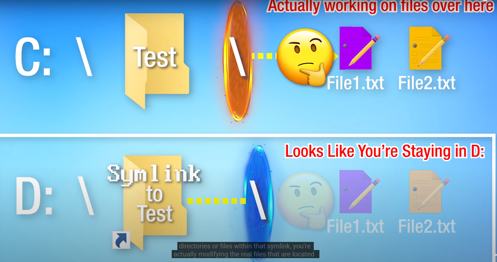

__Symbolic Links in Windows__

----

* Source: [Youtube](https://youtu.be/RDH5IuyPJtk)

* Real-Time Examples:
    - Cloud Sync for folders at various locations
    - Installing applications in other drives

* Details:
    - Three types of Symbolic Links
        1. Symbolic Link :

            Pros: 

                - Redirects to files and directories

            Cons:

                - Only works for directories
                - Has to be on same Computer

        2. Junction aka Softlink

            Pros: 

                - Used for security where you don't want to map to other N/w drives.

        3. Hard Links

            Pros: 

                - Hard Links get updated automatically when source files are moved

            Cons:

                - only works for Files
                - Has to be on the same volume
        
* Usage:

    type `mklink` in command prompt to get usage

    Examples:

    1. for a directory

        `mklink /D Link Target`

        Target - Folder to which symbolic link has to be created

        Link - Location where symbolic link has to be created

        /D - For a Directory 

    

